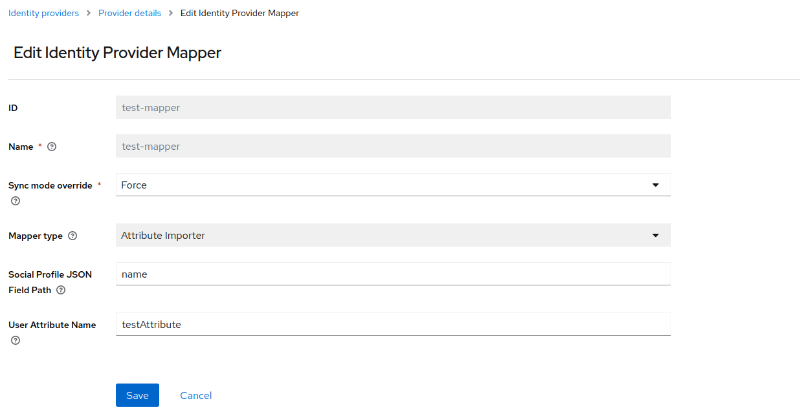

> :rocket: **Try it for free** in the new Phase
> Two [keycloak managed service](https://phasetwo.io/?utm_source=github&utm_medium=readme&utm_campaign=keycloak-idp-oauth2).

# keycloak-idp-oauth2

This is an OAuth 2.0 Identity Provider implementation for Keycloak. 

> But OAuth2 doesn't inherently provide identity information!

Correct. This overrides the identity portions of the `OIDCIdentityProvider` class to allow retrieval of identity information by script. This allows the administrator to provide a custom script as a configuration value of the identity provider. The script is executed (js using Nashorn) with a limited scope once the authorization code flow has been executed by the user, and the IdP has returned information sufficient to authorize retrieval of identity information.

See our [motivation](./docs/motivation.md) for more information.

## OAuth2 Scripted identity provider

A standard OAuth 2.0 Identity Provider that retrieves identity information by script.

## Installation

1. Build the jar:

```
mvn clean install
```

2. Copy the jar produced in `target/` to your `providers` directory (for Quarkus) or `standalone/deployments`
   directory (for legacy) and rebuild/restart keycloak.

## Implementation Notes

The identity provider is persisting a script as a configuration value. This script is executed by
the [Nashorn scripting engine]("https://www.oracle.com/technical-resources/articles/java/jf14-nashorn.html").
The script will be executed once the authorization code flow has been executed by the user. This will retrieve the
identity information required for creating a keycloak user.

When writing the script be aware of `Nashorn` has some limitations. It supports ECMAScript 5.1 and some ECMAScript 6
features.

The script must return a `BrokeredUserProfile` otherwise the Identity provider will throw an error.

```java
public class BrokeredUserProfile {

    private String username;
    private String firstName;
    private String lastName;
    private String email;

    private Object mappingContext;
}
```

The `username` field of the BrokeredUserProfile is mandatory.

In order to use an identity provider mapper the `mappingContext` must be populated with a JSON object containing the information required for the mapping logic.  
A example can be seen in the Amazon identity provider [script](./docs/amazon-authenticator.md#identity-script).  
There is no need to add the `mappingContext` if no mapping is required after obtaining the identity information.

## Mappers

### Attribute importer mapper

Import user profile information if it exists in provider `mappingContext` JSON into the specified user attribute.



### Username Template Importer

Creates the username using the user profile information if it exists in provider `mappingContext` JSON.

## Demo

See the following example provider configurations:

1. [Amazon](./docs/amazon-authenticator.md)
2. [Discord](./docs/discord-authenticator.md)
3. [Dropbox](./docs/dropbox-authenticator.md)
4. [Github](./docs/github-authenticator.md)
5. [Box](./docs/box-authenticator.md)
6. [Stripe Connect](./docs/stripe-connect-authenticator.md)

---

All documentation, source code and other files in this repository are Copyright 2024 Phase Two, Inc.

